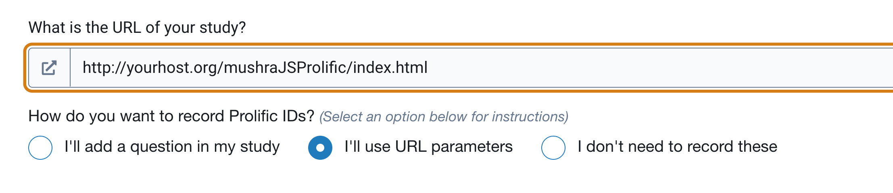
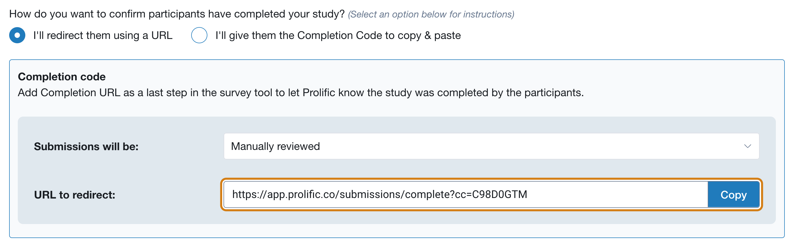
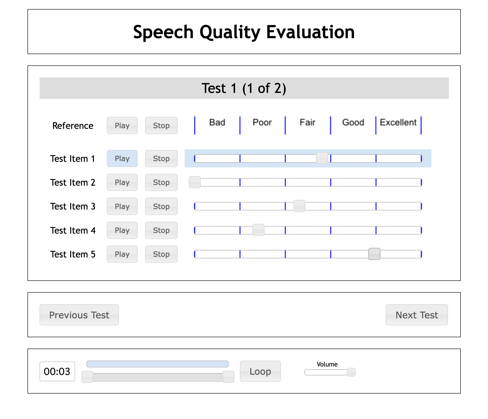

# [mushraJS](https://github.com/chrisbaume/mushraJS)  を　[Prolific](https://www.prolific.co/) で利用できるように改造
 
音声評価ITU標準 MUSHURA (Multiple Stimuli with Hidden Reference and Anchor) をWeb上で実行する MusuraJS を、クラウドサーベイシステム Prolificと接続できるように改造したものです。

## Prolific側の設定


のようにしてこのページにサーベイをリダイレクトするように設定。`I'll use URL parameters`を選択。


`I'll  redirect them using a URL` を選択して redirect URLを得る。

## mushraJS側の設定

example_config.js の
```
"ReturnURL": "https://app.prolific.co/submissions/complete?cc=XXXYYYZZZ", 
```    
をProlificの redicrect URLに設定。

results に結果が保存されるので、PHPでアクセスできるように
`$ chwon apache retuls`
としておく。

以下のうなインタフェースで音声評価ができる。音声ファイルや質問数は`example_config.js`を編集して設定できる:


回答ごとに、
```json:results/R__0128-0201.json
{"ratings":{"0":{"0":56,"1":79,"2":28,"3":0,"HiddenRef":46},"1":{"0":61,"1":67,"2":44,"3":46,"HiddenRef":38}},"id":"aabbccc14d21e35401656"}
```
のようなファイルが生成される。

- [MUSHRA](https://en.wikipedia.org/wiki/MUSHRA) : ITU-R 音声評価方式標準
- [Prolific](https://www.prolific.co/) : クラウドソーシングサーベイシステム
- [mushraJS](https://github.com/chrisbaume/mushraJS) : MUSHRA をWebサービスとして利用可能にしたもの


 mushraJS
=====================

Description
---------------------

**mushraJS** is a HTML5 and JavaScript based framework to perform MUSHRA listening tests. 
MUSHRA is the abbreviation for *MUlti Stimulus with Hidden Reference and Anchor* and 
describes a method for the subjective evaluation of audio quality. It is described in detail 
in the [ITU-R recommendation BS.1534-1](http://www.itu.int/rec/R-REC-BS.1116-1-199710-I/e).

The framework does not rely on any server side ressources and is capable to completely run 
locally in your browser. However you could publish the configured test scripts on a web 
server to easily reach your participants or even transmit the results to a web service 
for collection and further evaluation.

MushraJS has already been used for for real listening tests by the author and should work 
reliably. Anyway, please thoroughly test your setup before your public test starts.


Requirements
---------------------

As the framework uses modern HTML5 techniques for audio playback and the user interface it 
is very important to use a modern web browser. The support for different audio file types 
varies a lot between the different browsers. I would recommend to use .WAV files as these 
are lossless and supported by all major browsers with the only exception of the Microsoft 
Internet Explorer. Other file formats like .FLAC, .MP3 or .OGG are only supported by 
different subsets of browsers.

JQuery and JQueryUI are used to simplify the coding with JavaScript. Both are already part of 
the package and can be found in `js/` subfolder.


Configuration
---------------------

The configuration of the test is written in [JSON format](http://en.wikipedia.org/wiki/JSON). 
See `example_config.js` to get an impression on how it works, it should be pretty self explanatory. 
The config is loaded before any other JavaScript files in the header of the `index.html` file.

Some of the texts, for example the introduction on the first page, can be edited in the 
`index.html` file. The corresponding `<div>` tags are marked by comments.


Server side data evaluation
---------------------

It is possible to send the results to a server script and to collect and evaluate them 
in a central place. See `results.php` for a basic example. This saves the transmitted 
results in a human readable .TXT file with the timestamp in its name. This is not intendend 
to run out of the box and needs some PHP and JS skills to get it up and running. There 
are plans for a more comfortable server backend but currently no time is available to work on this.


Contact
---------------------

sebastian_kraft (AT) gmx (DOT) de


License
---------------------

The complete sources, html and script files as well as images are released unter the *GPLv3 
license*. A copy of the GPL is provided in the `LICENSE.txt` file.
